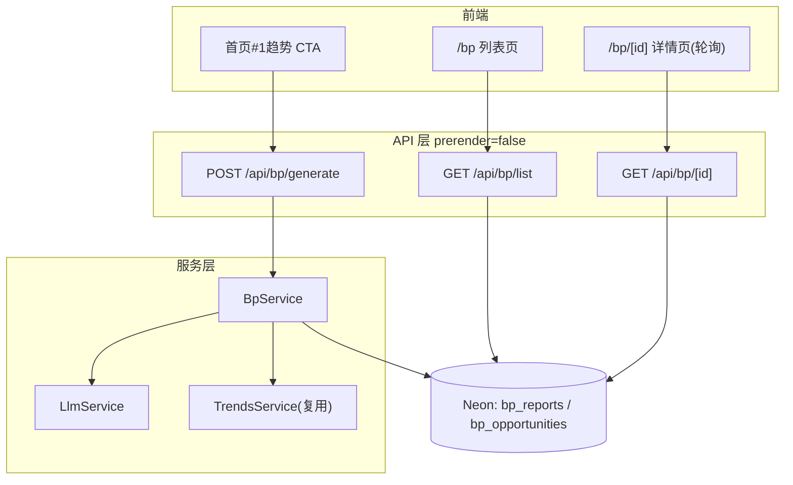

# 设计文档

## 概述

「热词第一名 → BP」在现有 Astro + React + Neon 架构上新增一条服务端流水线与两张数据表，复用现有 `TrendsService`、`db/client`、中间件鉴权（`Astro.locals.user`）与 i18n。生成逻辑由 `LlmService`（OpenAI 兼容调用）与 `BpService`（编排 + 持久化）组成，对外暴露 3 个 API，并新增 2 个站内页面。

## 架构



## 数据流（生成）

1. 鉴权：中间件解析 `session_token` → `locals.user`；无用户则 `generate` 返回 401。
2. 取数：`BpService.resolveSourceTrend()` 优先用入参 `trendId/keyword`，否则 `TrendsService.getTrends({ pageSize:1, sortBy:'search_volume', sortOrder:'desc', timeRange })` 取第一名。
3. 去重：按规范化 `keyword` 查 `bp_reports` 是否存在近期 `completed` 记录，命中则直接返回。
4. 落库占位：插入 `bp_reports`（status=`generating` + 趋势快照 + user_id）。
5. 编排：`LlmService.generateBp(trend)` 一次性返回结构化 JSON（候选机会+评分+选定+BP 正文+种子轮回报）。
6. 解析校验：JSON 解析 + 必填字段校验，失败重试 1 次。
7. 落库完成：更新 `bp_reports`（content_json/title/summary/selected/model/tokens/status=`completed`），批量插入 `bp_opportunities`。
8. 失败路径：任一步异常 → 更新 status=`failed` + error。

## 数据库设计（仅新增，不改现有表）

### bp_reports
| 列 | 类型 | 说明 |
|---|---|---|
| id | UUID PK | 默认 uuid_generate_v4() |
| keyword | VARCHAR(200) NOT NULL | 来源关键词 |
| keyword_norm | VARCHAR(200) | 规范化关键词（小写 trim），用于去重 |
| source_trend_id | VARCHAR(100) | 来源趋势行 id 快照 |
| search_volume | BIGINT | 趋势快照 |
| growth_rate | NUMERIC | 趋势快照 |
| category | VARCHAR(100) | 趋势快照 |
| time_range | VARCHAR(20) | 趋势快照 |
| region | VARCHAR(50) | 趋势快照 |
| rank | INT | 第一名=1 |
| status | VARCHAR(20) | pending/generating/completed/failed |
| title | TEXT | BP 标题 |
| summary | TEXT | 执行摘要 |
| selected_opportunity | TEXT | 选定机会名 |
| content_json | JSONB | 完整结构化 BP |
| model | VARCHAR(100) | 所用模型 |
| tokens_used | INT | token 用量（可空） |
| error | TEXT | 失败原因（可空） |
| user_id | UUID | 触发者，REFERENCES users(id) ON DELETE SET NULL |
| created_at / updated_at | TIMESTAMPTZ | 时间戳 |

索引：`idx_bp_reports_keyword_norm`、`idx_bp_reports_status`、`idx_bp_reports_created_at`、`idx_bp_reports_user_id`。

### bp_opportunities
| 列 | 类型 | 说明 |
|---|---|---|
| id | UUID PK | |
| report_id | UUID NOT NULL | REFERENCES bp_reports(id) ON DELETE CASCADE |
| name | TEXT NOT NULL | 机会名 |
| description | TEXT | 机会简述 |
| score_market / score_roi / score_onlineability / score_feasibility / score_speed / score_moat | NUMERIC | 六维分值 |
| weighted_score | NUMERIC | 加权总分 |
| is_selected | BOOLEAN DEFAULT false | 是否选定 |
| rank | INT | 排名 |
| created_at | TIMESTAMPTZ | |

索引：`idx_bp_opportunities_report_id`。

迁移：在 [src/pages/api/db-init.ts](../../../src/pages/api/db-init.ts) 的 `BASE_STATEMENTS` 追加上述建表与索引（幂等）；`REQUIRED_COLUMNS` 增加 `bp_reports`/`bp_opportunities` 诊断；新增 `?migrate=bp` 分支做破坏性重建（DROP CASCADE 后重建）。

## LLM 编排与 JSON 契约

- 接口：`POST {LLM_API_BASE}/chat/completions`，Header `Authorization: Bearer {LLM_API_KEY}`，body `{ model, messages, temperature, response_format:{type:'json_object'} }`。
- 默认：`LLM_API_BASE=https://api.deepseek.com`，`LLM_MODEL=deepseek-v4-pro`（均可被环境变量覆盖）。
- 超时：`AbortController` + `LLM_TIMEOUT_MS`（默认 45000）；失败/解析失败重试 1 次。
- 输出契约（强制 JSON）：

```jsonc
{
  "title": "string",
  "summary": "string",
  "selectedOpportunity": "string",
  "opportunities": [
    { "name":"", "description":"",
      "scores": { "market":0, "roi":0, "onlineability":0, "feasibility":0, "speed":0, "moat":0 } }
  ],
  "market": { "tam":"", "sam":"", "som":"", "notes":"" },
  "businessModel": "string",
  "financials": { "years": [ {"year":1, "revenue":"", "ebitda":""} ] },
  "seedReturn": {
    "bookRoiByYear": [50, 140, 380, 495, 665],
    "annualizedBook": "≈50%",
    "winRate": "28%",
    "profitLossRatio": "4.0:1",
    "expectedValueMOIC": "1.37x",
    "riskAdjustedAnnualized": "≈6.5%",
    "notes": "现金退出口径说明"
  }
}
```

- 加权总分由服务端用固定权重重算（不信任模型自报），保证需求 2.3 自洽：
  `weighted = market*0.20 + roi*0.25 + onlineability*0.15 + feasibility*0.15 + speed*0.10 + moat*0.15`。
- 服务端二次校验：`opportunities.length >= 5`、每项 scores 6 个键齐全、`seedReturn` 关键指标齐全、选定项为加权最高者（若模型给的与重算不一致，以服务端重算为准并覆盖 `selectedOpportunity`）。

## API 设计

| 方法/路径 | 鉴权 | 说明 |
|---|---|---|
| POST `/api/bp/generate` | 需登录 | body `{ keyword?, trendId?, timeRange? }`；返回 `{ success, data:{ id, status } }` |
| GET `/api/bp/list` | 公开 | query `page,pageSize`；返回报告分页（不含大 JSON） |
| GET `/api/bp/[id]` | 公开 | 返回单份报告 + `opportunities[]` |

错误码：401（未登录）、400（无趋势/入参非法）、503（LLM 未配置）、500（DB/未知）。

## 前端设计

- 入口：[src/components/trends/TrendsTable.astro](../../../src/components/trends/TrendsTable.astro) 榜首行追加「生成 BP」按钮（登录可点，未登录跳 `/login`）；首页 [src/pages/index.astro](../../../src/pages/index.astro) 顶部加高亮 CTA 卡片。
- 页面：`src/pages/bp/index.astro`（列表，SSR 读 `BpService.list`）、`src/pages/bp/[id].astro`（详情，SSR 读单份；`generating` 时前端轮询 `/api/bp/[id]`）。
- 生成交互：客户端脚本 POST `/api/bp/generate`（带 `Origin`）→ 跳转 `/bp/{id}` → 轮询至完成。
- i18n：[src/lib/i18n/zh.ts](../../../src/lib/i18n/zh.ts)/[en.ts](../../../src/lib/i18n/en.ts) 新增 `bp.*`；Header 加导航。
- 安全：详情页渲染 LLM 文本统一经 `sanitizeInput` 或 Astro 默认转义（不使用 `set:html` 渲染不可信内容）。

## 错误、超时与成本（Netlify 约束）

- Netlify 函数默认超时较短（约 10s，部分计划可至 26s），LLM 生成可能超时。缓解：
  1. 去重复用优先，避免重复生成；
  2. 限制输出规模（提示中约束字数与机会数量、`max_tokens`）；
  3. `generating` 占位 + 详情页轮询，失败可重试，不阻塞用户；
  4. `design.md` 注明：如需更长生成，可后续改为 Netlify Background Function（本期同步实现，超时即记 `failed`）。

## 测试策略

- 单元（vitest）：六维加权评分计算、LLM JSON 解析与校验（含缺字段/非 JSON）、选定项一致化逻辑。
- E2E（live-smoke）：`GET /api/bp/list`（200 + 形态）、`GET /api/bp/{id}` 不存在返回 404、`POST /api/bp/generate` 未登录返回 401、未配置 LLM 返回 503。
- 构建：`npm run build` 通过。
