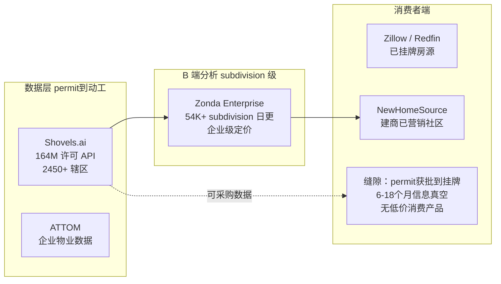

# SubDivFinder 商业机会再挖掘与分析报告

**分析对象**：AI 生成 BP《SubDivFinder：美国新楼盘实时监测与智能购房决策助手》（热词 "new subdivisions"，US 趋势榜第 40 名，dashscope/qwen-plus-latest，2026-07-13 06:55 生成，五维评分 42/50）
**报告日期**：2026-07-14
**可复现性**：本报告全部数学结论可由随附脚本一键复现，全部事实主张附权威出处与抓取日期：

```bash
python scripts/verify_subdivfinder_math.py     # 数学复算 + 修正后模型
# 事实与出处快照：docs/data/subdivfinder-sources.json
# BP 原文存档：    docs/data/subdivfinder-bp-original.md
```

---

## 0. 结论先行（TL;DR）

1. **原 BP 的 42/50 评分不成立**。逐项核查 12 项关键主张：**5 项被证伪、3 项部分属实、2 项无法核实、仅 2 项基本属实**；5 项数学检验中 2 项算术错误（最严重者差 333 倍）、3 处口径自相矛盾。按修正后事实重评，该机会约为 **26/50**——从"最优"降为"不推荐直接执行"。
2. **但热词背后的需求信号是真的，且确实存在一个未被占据的缝隙**：从建筑许可获批到房源挂牌之间 6~18 个月的"信息真空"在**消费者端**没有低价产品服务（B 端已被 Zonda/Shovels 占据且定价企业级）。只是正确的商业形态**不是 $9.99/月订阅**（复算显示付费获客 LTV/CAC 仅 0.08~0.19），而是 **程序化 SEO + 购房线索转售（lead-gen）**——与建商每获客一名真实买家愿付 $30~$100+ 的既有行业付费习惯对接。
3. **执行建议**：不按原 BP 推进。若要验证缝隙，按第 7 节的三阶段方案，先花 <$500、2 周做需求与数据可得性实测，止损标准明确。

## 1. 诚实声明

- 被分析 BP 由 LLM（qwen-plus-latest）生成。经查证，其不在本项目生产库中（bp_reports 为六维评分体系），应出自同源项目的另一套部署（五维体系）；原文已照录存档于 `docs/data/subdivfinder-bp-original.md`。
- 本报告的"证伪/证实"判定基于 2026-07-14 检索到的公开权威来源（NAR、Census/HUD、CSBS/NMLS、NASA、WordStream/LocaliQ、企业官网），检索快照存于 `docs/data/subdivfinder-sources.json`。若来源日后更新，判定应随之复核。
- 第 6、7 节的机会重估与验证方案含判断性内容，均以"概率与区间"表达并标明假设；不构成投资建议。

## 2. 逐项核实：12 项关键主张

| # | BP 主张 | 核实结果 | 判定 |
| --- | --- | --- | --- |
| C1 | 首次购房者占 43%（约 210 万人/年） | NAR 2025 官方报告：**21%**，1981 年来最低；43% 接近 2008 年前的历史常态。按 2025 年成屋 406.1 万 + 新房 67.9 万宗交易计，首购族 ≈ **99.5 万人/年**，高估 2.1 倍 | **证伪** |
| C2 | 美国每年新增 120 万套新房 | 2025 年开工 135.9 万套（Census/HUD）、新房销售 67.9 万套——开工口径略低估，销售口径高估一倍，口径含糊 | 部分属实 |
| C3 | "现有工具无 subdivision 级施工进度"（竞争 7/10） | **Zonda Enterprise 日更追踪 54,000+ 在建/规划 subdivision**（500+ 指标、地块状态、开工/交房），消费者端有其 NewHomeSource（自称全美第一新房平台） | **证伪** |
| C4 | SubDivMap Pro：许可数据 API 是空位（39/50） | **Shovels.ai 已占据**：1.64 亿许可、2,450+ 辖区（≈85% 人口）、LLM 清洗、REST API | **证伪** |
| C5 | 差异化 = "NASA FIRMS API 卫星变化检测验证动工" | **FIRMS 是野火热异常检测系统**（MODIS 1km / VIIRS 375m），探测火点、火山、燃气火炬，既无变化检测能力、分辨率也差两个数量级。属技术幻觉 | **证伪** |
| C6 | 解析全美 2,200+ 县许可库；12 个月覆盖全美 | 美国许可签发辖区（AHJ）约 **20,000 个**；专业公司 Shovels 融合多家上游也只覆盖 ~2,450 个。12 个月单团队覆盖全美严重低估工程量 | **证伪** |
| C7 | Google Ads CPC $0.8 | WordStream/LocaliQ 2026 基准（13,477 个美国广告系列）：房地产 CPC 中位数 **$3.22**，且年涨 27%。低估 4 倍 | **证伪** |
| C8 | churn 3.5%/月，"来源 OpenView PE 2024 Benchmark" | OpenView 2023-12 已停止新投资，其报告止于 2023 版；2024 版由 High Alpha 接手且无此细分数字。**引用出处不成立**（数值本身作为假设不离谱） | 无法核实 |
| C9 | 房贷经纪约 12.4 万家机构 | CSBS/NMLS 2024 年报：全部州牌照非银公司约 **3.4 万家**（含汇款、消金、催收等）。高估 3~4 倍 | **证伪** |
| C10 | 与 Blend、Roostify 集成；Realtor.com 开放 API 导流 | **Roostify 2023-02 已被 CoreLogic 收购**并入其 DMP；Realtor.com 并无公开的第三方导流 API。GTM 名单过时 | 部分属实 |
| C11 | "new subdivisions" 月搜索量 5000+ | 免费渠道无法核实（需关键词工具实测）；趋势榜第 40 名是单日瞬时信号。量级不离谱，但据此推导的用户量算错 333 倍（见 M5） | 无法核实 |
| C12 | Attom 企业合同 $5k/年起、无消费者界面 | 无消费者界面属实；"$5k/年"无公开价目可证 | 部分属实 |

> 完整证据链（含每条来源 URL 与抓取日期）见 `docs/data/subdivfinder-sources.json`。

## 3. 数学复算（脚本 Part A 输出摘要）

| # | 检验项 | 结果 |
| --- | --- | --- |
| M1 | TAM 算式 2.1M×15%×$120=$37.8M | 算术 PASS（但输入 210 万已被 C1 证伪，修正后 TAM=$17.9M） |
| M2 | CAC "=$0.8×3.2" 却报 $2.1 | **DEVIATION**：其自己的算式给出 $2.56，自相矛盾 22% |
| M3 | LTV $119.88 | 算术 PASS，但**口径矛盾**：$119.88 恰为 12 个月收入；若按其同时引用的 churn 3.5%/月，LTV 应为 $285（28.6 个月）——两种口径混用 |
| M4 | LTV/CAC=57.1 | 按声称值算术成立；但健康基准 3~5x，57x 本身即输入失真的信号 |
| M5 | "5000 月搜索 ×CTR2%×转化15%×12 = 6 万年活跃用户" | **DEVIATION**：该链条实际得出 **180 人/年**，与 6 万差 **333 倍**；要得 6 万需月搜索 167 万 |
| M6 | Roadmap 自洽性 | 0-3 月"5,000 UV/月"与"注册破 1 万"隐含**访客→注册转化率 67%**（行业 2~5%）；3-12 月 ARR $1.2M 需注册用户 28.2 万，是前一阶段目标的 28 倍，无机制说明 |

**Part A 结论**：BP 的关键结论（"约 6 万年活跃用户""LTV/CAC=57"）建立在算术错误与口径混用之上，即使不动任何外部事实，仅凭其自身假设也推不出其结论。

## 4. 修正后模型（脚本 Part B，全部输入有出处）

**市场规模**：年首购族 ≈ 99.5 万（NAR 21% × 474 万宗交易）→ 修正 TAM = 99.5 万 × 15% × $120 ≈ **$17.9M/年**（BP 的一半；且 15% 渗透率沿用 BP 未经证实的假设，实际大概率更低）。$18M TAM 的全国性消费订阅，对创业公司是利基生意，对平台型公司不构成赛道。

**付费获客单位经济**（CPC 取 2026 房地产中位数 $3.22；注册→付费 4.3% 用 BP 自己声称的基准）：

| 情景 | 访客→付费 | CAC | LTV（churn 口径 $285） | LTV/CAC |
| --- | --- | --- | --- | --- |
| 悲观 | 0.09% | $3,744 | $285 | **0.08** |
| 基准 | 0.15% | $2,140 | $285 | **0.13** |
| 乐观 | 0.21% | $1,498 | $285 | **0.19** |

三情景全部远低于健康线 3——**付费广告获客对 $9.99/月订阅完全不成立**（BP 得出 57.1 靠的是把 CPC 压低 4 倍 + 假设 31% 的点击→付费转化率）。

**结构性约束**：购房决策窗口通常仅数月，窗口关闭即退订。按 6 个月窗口口径 LTV ≈ $60，比 churn 口径再低 4.8 倍。**订阅制与"低频、一次性人生决策"场景存在根本性错配**——这是原 BP 五维评分体系（无"需求频次/留存适配"维度）探测不到的缺陷。

## 5. 竞争格局重绘



- **B 端全线被占**：subdivision 级分析（Zonda）、许可 API（Shovels）、物业大数据（ATTOM/CoreLogic）——BP 的五个候选中 SubDivMap Pro（39/50）撞在 Shovels 正面，SubDivFinder 的 B 端故事撞在 Zonda 正面。
- **真实缝隙只有一个**：消费者以 $0~10/月成本获知"我关注的区域刚批了/刚动工了什么新社区"。Zillow/Redfin 只有已挂牌房源；NewHomeSource 只展示建商付费营销的社区；Zonda 数据齐全但起步即企业合同。**缝隙存在，但小于 BP 的描绘，且变现方式必须换**（见第 6 节）。

## 6. 五候选重估与再挖掘

用修正后事实对五个候选重新打分（同一五维口径以便对照；调整依据在括号内注明。评分为结构化判断，非测量值）：

| 机会 | 原分 | 重估 | 关键调整依据 |
| --- | --- | --- | --- |
| SubDivFinder（全国订阅 SaaS） | 42 | **26** | 市场 9→6（TAM 减半且渗透率存疑）；竞争 7→4（Zonda/NewHomeSource 在位）；实现难度 8→4（20k AHJ 而非 2.2k 县、FIRMS 差异化为幻觉）；变现速度 8→5（LTV/CAC<0.2，付费获客不通） |
| SubDivIQ Reports（邮编周报内容订阅） | 40 | **29** | 可 SEO 驱动、边际成本低（+）；但同样撞需求低频墙，且"人口流入预测/税收模拟"的可信数据源成本高（−） |
| NewHome Scout（筛选清单+导流） | 37 | **31**（改造后最高） | 形态最接近正确变现（线索转售）；原设计"跳转 MLS 授权页"有 IDX 授权门槛，改为**直连建商销售处的 lead-gen** 则对接建商既有获客预算（行业单条购房线索 $30~100+ 的付费习惯），是五者中唯一 LTV/CAC 可为正的路径 |
| BuildTrack Alerts（浏览器插件） | 38 | **22** | 分发依赖应用商店与第三方页面结构（脆弱）；插件用户到收入的链路最长 |
| SubDivMap Pro（数据 API） | 39 | **18** | 与 Shovels 正面竞争且无数据资产积累，几乎无胜算 |

**再挖掘核心结论**：热词 "new subdivisions" 背后的真实资产不是"又一个订阅 SaaS"，而是——

> **单一高增长都会区的"新社区早知道"程序化 SEO 站 + 建商线索转售**：
> 用 Shovels API（买数据而非自建 20k 辖区爬虫）+ 县 GIS 公开数据，为 1 个都会区（如 DFW、Phoenix、Houston 等 permit 量前 10 的 metro）自动生成"每个新获批/新动工 subdivision 一页"的内容站，捕获 "new subdivisions near me / in [city]" 长尾搜索，把留下邮箱的意向买家作为线索出售给该社区建商或本地经纪。
> 相对原 BP 的改动：全国→单城（工程量降两个数量级）；订阅→线索（对接既有付费习惯）；自建爬虫+卫星→采购 API（Build vs Buy）；LLM 幻觉的差异化→SEO 时效差异化（比 NewHomeSource 更早覆盖"获批未营销"的社区）。

该改造后的机会**成立概率为中低**（本报告判断：p(找到可持续正向单位经济) ≈ 20~35%），主要不确定性在：⑴ 该长尾词族的真实搜索量；⑵ "获批未挂牌"阶段的买家意向线索对建商的实际价值。两者都可以用第 7 节的低成本实验直接测量，无需信仰。

## 7. 若要验证：三阶段方案（含止损标准）

| 阶段 | 谁/资源 | 做什么 | 可检验标准（不达即止损） |
| --- | --- | --- | --- |
| 0（第 1-2 周，<$500） | 1 人 + Ahrefs 试用 + Shovels 免费层 | ① 关键词工具实测 "new subdivisions*" 词族分城市搜索量；② 选 3 个候选 metro 实测 permit 数据可得性/时效；③ 在 Reddit r/FirstTimeHomeBuyer 等社区做 20 份需求访谈 | 词族合计月搜索 <10k 或目标 metro 数据延迟 >30 天 → 停 |
| 1（第 3-10 周，<$3k） | 1 人 + Shovels 付费层 + Astro 静态站 | 单 metro MVP：程序化生成 200~500 个 subdivision 页面 + 邮箱订阅（先不收费不卖线索），全自动管线复用本项目既有架构 | 8 周后自然点击 <500/月 或 访客→邮箱转化 <2% → 停 |
| 2（第 11-18 周） | 同上 | 线索变现实验：与 5 家该 metro 建商/经纪谈线索单价，或挂 Zillow/NewHomeSource 联盟；A/B 对比订阅付费墙 | 单条线索确认售价 <$15 或月线索 <50 条 → 停；达标则第二个 metro 复制 |

总止损预算 ≈ $3,500 + 约 120 工时。每阶段标准均为客观可测数字。

## 8. 对 BP 生成系统的改进建议（自我批评，反哺本项目）

本次人工再挖掘暴露的四类系统性缺陷，与 7-13《线上商业机会分析报告》的发现（91.5% 自报回报超出复算区间）同源，建议依次修复：

1. **事实主张无来源核验**：市场占比、竞品空白、机构数量等可检索事实应在生成后经检索增强核验（或至少标注"未核验"），本例 12 项中 5 项证伪。
2. **算术不自洽**（差 333 倍的用户量推导）：生成后应用确定性代码复算 BP 内every算式——本项目已对 seedReturn 做复算校准，应扩展到 TAM/CAC/LTV/漏斗链条。
3. **评分体系缺"需求频次/留存适配"维度**：低频人生决策 + 订阅制的错配探测不到，五维/六维均然。
4. **竞争维度靠模型记忆**：Zonda/Shovels 均非冷门公司，检索一次即可发现；竞争格局分应要求列出至少 3 个实名竞品并附检索证据。

## 9. 复现步骤

```bash
# 数学复算 + 修正后三情景模型（全部输出即本报告第 3、4 节数字）
python scripts/verify_subdivfinder_math.py

# 逐项事实核查的证据链（12 项主张 × 来源 URL × 抓取日期）
#   docs/data/subdivfinder-sources.json

# 被分析 BP 原文（照录存档）
#   docs/data/subdivfinder-bp-original.md
```

关键外部来源（均于 2026-07-14 检索）：NAR《2025 Profile of Home Buyers and Sellers》、Census/HUD 2025-12 新房开工与销售月报、CSBS/NMLS 2024 年报、WordStream/LocaliQ 2026 Google Ads 基准、NASA FIRMS 官方文档、Zonda/Shovels/CoreLogic 官网与新闻稿。
